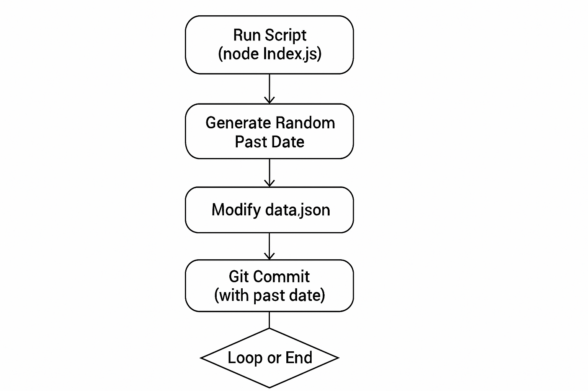

## 🤖 GitHub Contribution Graph Enhancer (goGreen Fork)

[](/LICENSE) 
[](https://github.com/Dynamo14324/github-bot/actions/workflows/node.js.yml) 
[](https://github.com/Dynamo14324/github-bot/stargazers)
[](https://github.com/Dynamo14324/github-bot/network/members)
[](CONTRIBUTING.md)

Ever wished your GitHub contribution graph looked a bit more... active? Or perhaps you want to create some pixel art on your profile? This Node.js script, originally inspired by **goGreen**, allows you to programmatically create commits dated in the past (or future!), effectively painting your contribution graph green.

**Important Disclaimer:** This tool is primarily intended for creative expression and personal use cases, such as:
*   Filling in legitimate contribution gaps from offline work or private repositories.
*   Creating pixel art or patterns on your GitHub profile graph.
*   Learning about Git internals and scripting.

Using this tool solely to misrepresent your activity level or inflate contribution metrics is strongly discouraged and goes against the spirit of open source collaboration.

### Enhanced Project Overview: Mastering Your GitHub Contribution Graph

Your GitHub contribution graph is a visual representation of your coding journey, a testament to your activity and dedication. Whether you\`re a seasoned developer, an aspiring open-source contributor, or simply looking to add a creative touch to your profile, the **GitHub Contribution Graph Enhancer** (a powerful fork of `goGreen`) provides you with unparalleled control over this digital canvas.

## ✨ Features

*   **Backdate Commits:** Create commits for any past date to fill your GitHub contribution graph.
*   **Simple Setup:** Easy to configure and run using Node.js and npm.
*   **Customizable:** Modify the script to control commit frequency, date ranges, and patterns.
*   **Creative Potential:** Design unique patterns or artwork on your contribution graph.
*   **Repository Specific:** Commits are made within the cloned repository, targeting `data.json`.

## 🚀 Getting Started

Follow these steps to get the script running:

1.  **Clone this Repository:**
    ```bash
    git clone https://github.com/Dynamo14324/github-bot.git
    cd github-bot
    ```

2.  **Install Dependencies:**
    Ensure you have Node.js (v14 or later recommended) and npm installed. Then run:
    ```bash
    npm install
    ```
    This installs the necessary packages: `moment`, `simple-git`, `jsonfile`, and `random`.

3.  **Configure Git:**
    *   The script makes commits *within this cloned repository* (`github-bot`).
    *   Set your Git user name and email locally for this repository (or ensure they are set globally):
        ```bash
        git config user.name "Your Name"
        git config user.email "your.email@example.com"
        ```
    *   **Crucial Step:** The script modifies the `data.json` file with each generated commit. You **must** push these changes back to *this* repository (`Dynamo14324/github-bot` or your fork) for the contributions to appear on your profile graph associated with this specific repo.

4.  **Run the Script:**
    Execute the script to start generating backdated commits:
    ```bash
    node index.js
    ```
    The console will output the dates for which commits are being created.

5.  **Push Your Changes:**
    After the script finishes (or periodically if running for a long time), push the accumulated changes in `data.json` back to GitHub:
    ```bash
    git add data.json
    git commit -m "chore: Update contribution data" # Example commit message
    git push origin main # Or your default branch
    ```
    Allow some time (usually minutes) for GitHub to process the commits and update your contribution graph.

## ⚙️ How It Works
The core logic resides in `index.js`. Here’s a breakdown:



1.  **Initialization:** Loads dependencies (`moment`, `simple-git`, `jsonfile`, `random`).
2.  **Date Generation:** Uses `random.choice` and `moment` to pick random dates within the last year (or as configured).
3.  **File Modification:** Reads `data.json`, updates a timestamp or counter within it, and writes the file back.
4.  **Git Commit:** Uses `simple-git` to stage `data.json` and create a commit. Crucially, it sets the `GIT_COMMITTER_DATE` and `GIT_AUTHOR_DATE` environment variables for the commit command, effectively backdating it.
5.  **Looping:** Repeats the process for a defined number of iterations (e.g., `ITERATION` constant).

## 🎨 Customization & Ideas

*   **Commit Frequency:** Modify the loop or `ITERATION` constant in `index.js` to control the number of commits.
*   **Date Range:** Adjust the `DATE` calculation logic using `moment` to target specific historical periods or even future dates.
*   **Pattern Generation:** Replace the random date generation with logic to create specific shapes or text on your contribution graph. This requires mapping desired pixels to specific dates.
*   **Target Different Repos:** Adapt the script to operate on a *different* local repository. This would involve changing the working directory for `simple-git` and ensuring that repository is properly initialized and configured.

## 🤝 Contributing

Contributions are highly welcome! Whether it\`s fixing bugs, improving documentation, or adding new features, your help is appreciated.

Please read our [CONTRIBUTING.md](CONTRIBUTING.md) for guidelines on how to contribute.

## 📜 License

Distributed under the MIT License. See `LICENSE` for more information.

## 🙏 Acknowledgements

*   Original concept inspired by similar projects and tutorials (like goGreen).
*   Essential Libraries: `moment`, `simple-git`, `jsonfile`, `random`.
